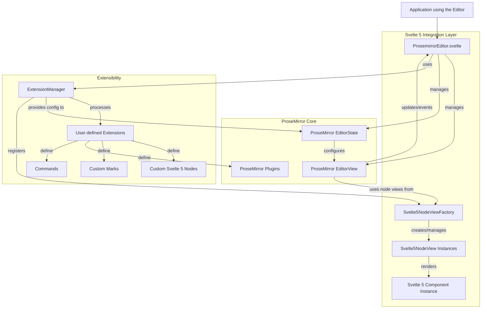

# New Core Package - Architecture Overview

This document outlines the proposed architecture for the new `packages/core`, combining Svelte 5 idioms with the rich ProseMirror integration capabilities.

## Key Components and Interactions

## Component Descriptions:

*   **Application**: The Svelte application that consumes the editor.
*   **ProsemirrorEditor.svelte (Svelte 5)**: The main Svelte 5 component that users will interact with. It wraps the ProseMirror editor, manages its lifecycle, and exposes an API (props, methods, events). This is inspired by `packages/bindings`.
*   **ProseMirror EditorView**: The standard ProseMirror `EditorView` instance.
*   **ProseMirror EditorState**: The standard ProseMirror `EditorState` instance, configured by extensions.
*   **ExtensionManager**: A module responsible for processing an array of user-provided extensions. It will build the schema, plugins, keymaps, and register Svelte 5 node views. This is inspired by the extension processing in `packages/old-core`.
*   **User-defined Extensions**: Objects provided by the user to customize the editor (defining nodes, marks, plugins, commands).
*   **Svelte5NodeViewFactory**: A factory responsible for creating `NodeView` constructors that can render and manage Svelte 5 components. This is the Svelte 5 equivalent of `SvelteNodeView` from `packages/old-core`.
*   **Svelte5NodeView Instances**: Instances created by the factory for specific nodes in the document. They handle mounting, updating, and destroying Svelte 5 components within the ProseMirror view.
*   **Svelte 5 Component Instance**: Actual instances of Svelte 5 components rendered as custom nodes within the editor.

## Key Goals for this Architecture:

1.  **Svelte 5 First**: Leverage Svelte 5 features (runes, `$props`, etc.) for the main editor component and internal Svelte node views.
2.  **Rich Svelte NodeViews**: Retain the ability from `old-core` to use Svelte components as first-class citizens for rendering ProseMirror nodes.
3.  **Extensibility**: Maintain a powerful extension system similar to `old-core`.
4.  **Simplified API**: Offer a clear and concise API through the main Svelte component, similar to `packages/bindings`.
