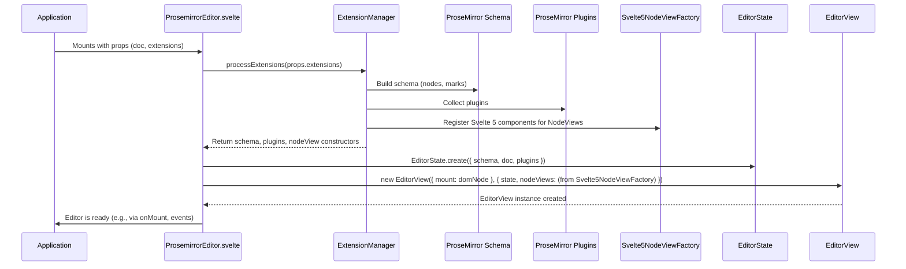
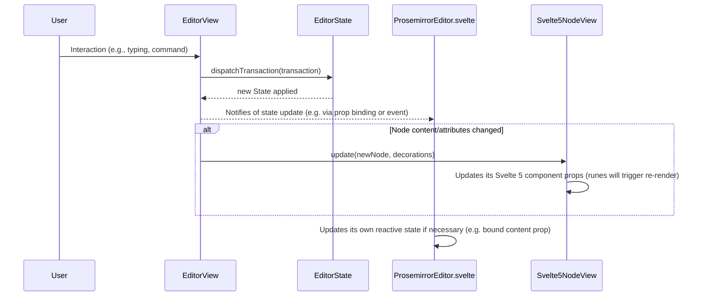
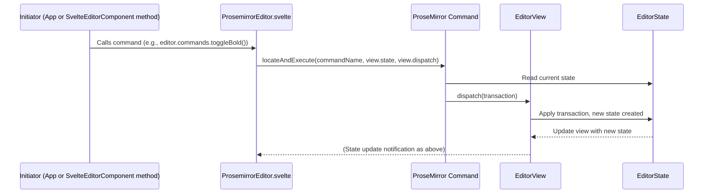

# New Core Package - Data Flow Diagrams

This document visualizes key data flows within the new `packages/core` architecture.

## Editor Initialization Flow (Svelte 5)

## Transaction Processing and Svelte 5 Component Update Flow

## Command Execution Flow

## Key Considerations for Data Flow:

*   **Svelte 5 Reactivity**: Leverage Svelte 5's runes for reactive updates within `SvelteEditorComponent` and `Svelte5NodeViewInstance` components. When props change in a `Svelte5NodeViewInstance`, its Svelte 5 component should reactively update.
*   **State Management**: The primary source of truth for editor content and selection is the ProseMirror `EditorState`. The Svelte layer reacts to changes in this state.
*   **NodeView Updates**: The `update` method of `Svelte5NodeViewInstance` will be critical. It receives a new ProseMirror node and must efficiently update the props of its managed Svelte 5 component.
