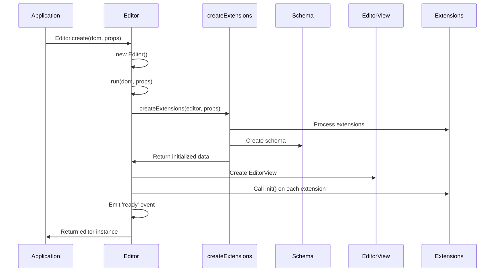
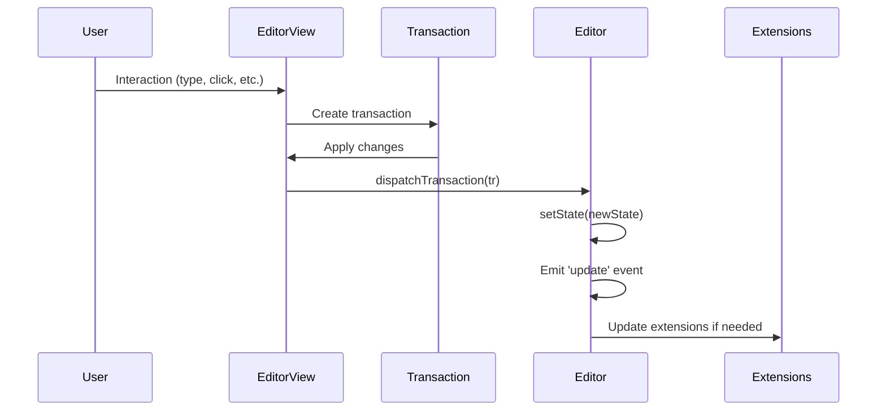
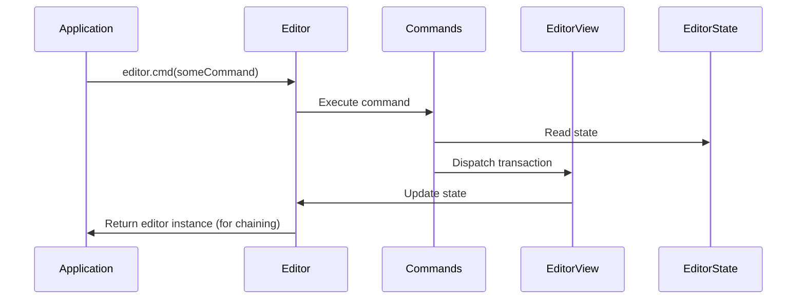
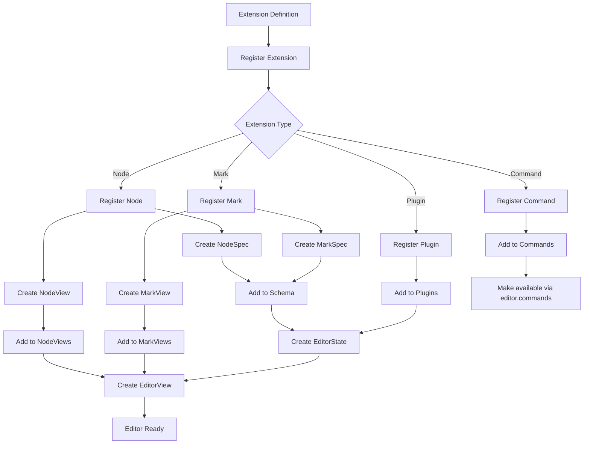
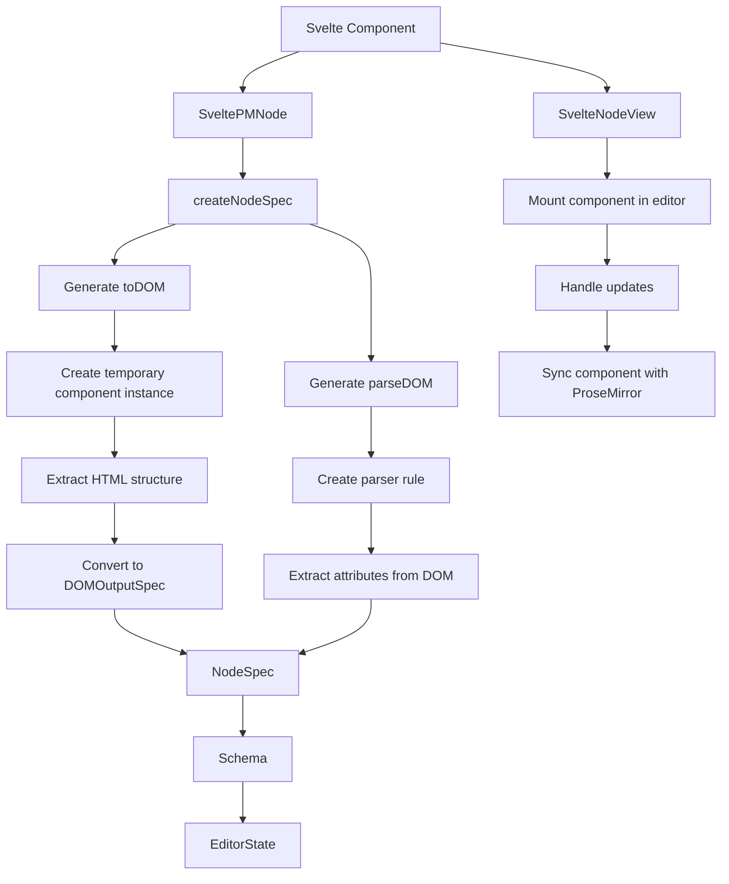

# Svelte-ProseMirror Core Flow Diagrams

This document contains Mermaid diagrams that visualize the flow of data and operations within the `packages/core` package.

## Editor Initialization Flow



## Transaction Flow



## Command Execution Flow



## Extension System Flow



## Svelte Component Integration



## Observable Pattern Implementation

```mermaid
flowchart TD
    A[Observable] --> B[Editor extends Observable]
    A --> C[Event Registration]
    C --> D[on - Register event handler]
    C --> E[once - Register one-time handler]
    C --> F[off - Remove handler]

    G[Editor Events] --> H[ready - Editor initialized]
    G --> I[update - State/props updated]
    G --> J[destroy - Editor destroyed]

    B --> K[Editor emits events]
    K --> L[Extensions listen for events]
    K --> M[Application listens for events]
