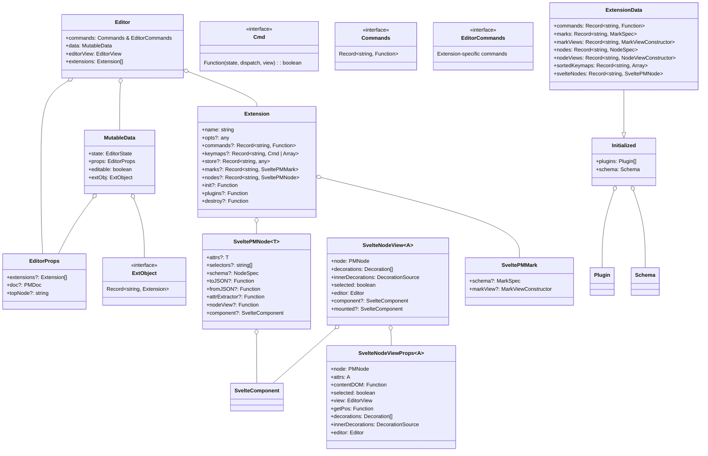
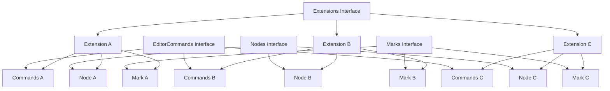
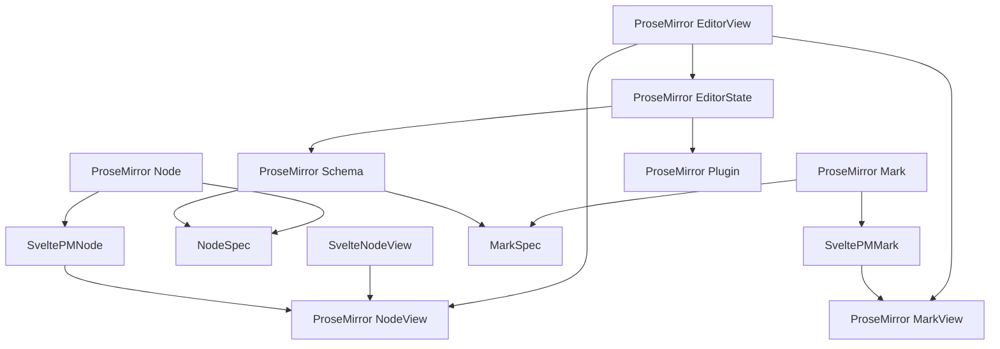
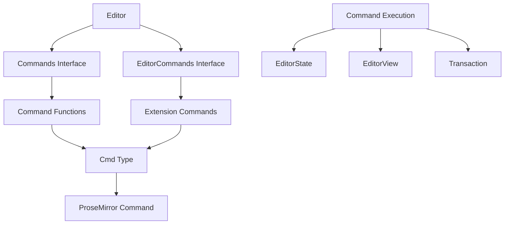

# Svelte-ProseMirror Core Type System Diagrams

This document contains Mermaid diagrams that visualize the type system within the `packages/core` package.

## Core Types Hierarchy



## Type Extensions and Augmentation



## ProseMirror Type Integration



## Command System Types



## Type Utilities and Helpers

```mermaid
graph TD
    UpdateArgs[UpdateArgs Type] --> MutableData
    EditorEvents[EditorEvents Type] --> Editor

    NodeProps[NodeProps Interface] --> PMNode
    NodeAttrs[NodeAttrs Interface] --> GenericAttrs[Generic Attributes]

    DocJSON[DocJSON Type] --> PMDoc[PMDoc Type]
    EditorStateJSON[EditorStateJSON Interface] --> DocJSON

    PMDoc --> JSONObject[JSON Object]
    DocJSON --> JSONObject
