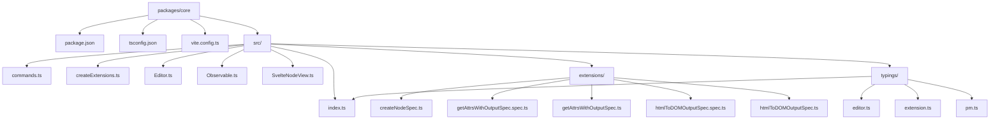
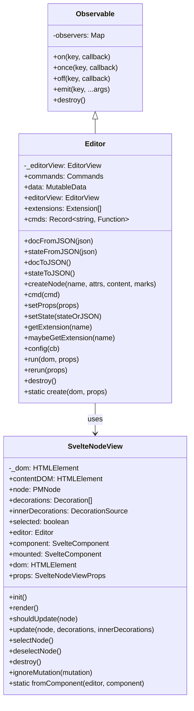
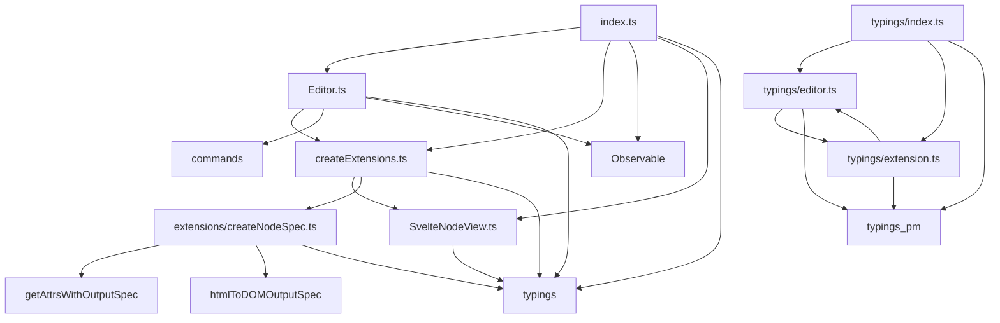
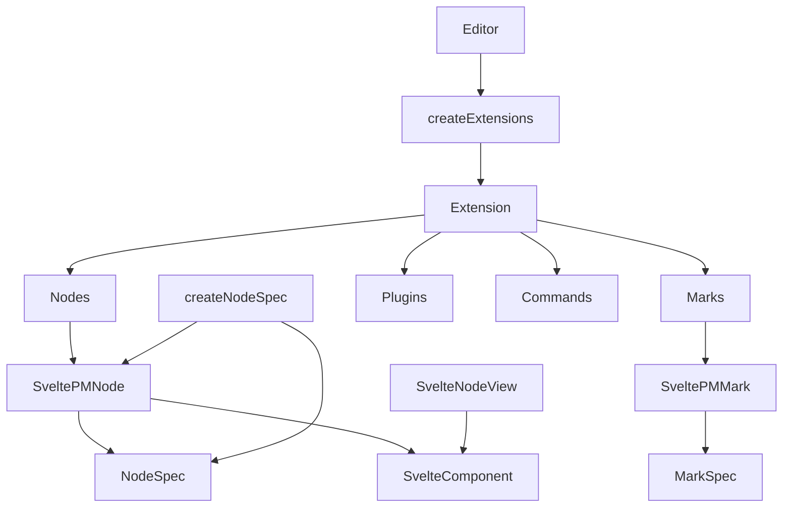
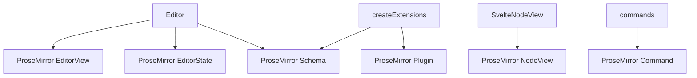

# Svelte-ProseMirror Core Package Diagrams

This document contains Mermaid diagrams that visualize the structure and relationships within the `packages/core` directory.

## Directory Structure



## Core Classes and Interfaces



## Module Dependencies



## Extension System



## ProseMirror Integration



## Package Dependencies

```mermaid
graph TD
    core[packages/core] --> prosemirror-model
    core --> prosemirror-state
    core --> prosemirror-view
    core --> prosemirror-commands
    core --> prosemirror-keymap
    core --> prosemirror-transform
    core --> svelte
